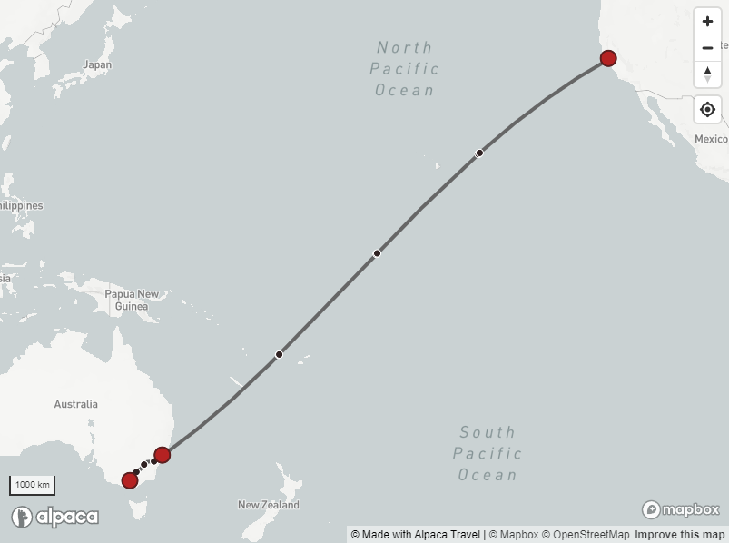

  

# Alpaca Travel Mapping Documentation

> [Alpaca Travel](https://alpaca.travel) offers mapping services for developers
> to build their own interactive travel maps.

Alpaca Travel is a platform focused on supporting travel content creators. In
addition to the embeddable versions of the content, Alpaca offer a set of
services to provide access to the data to build your own maps and applications.

[View the GraphQL API Documentation](https://github.com/AlpacaTravel/graphql-docs)

## Playground

Alpaca provides an interactive client that you can access for resources hosted
on the platform. This can be used to interact with features and identify what
mapping data is available.

- **[Mapping Service](https://mapping.withalpaca.travel/)**
  Interact with mapping resources (Requires API Key)

## Itinerary

Itineraries refers to the broad category of content published on the platform,
including trails, trips and lists.

- **[Working with GeoJSON and Vector Tiles](/topics/itinerary/Working%20with%20GeoJSON%20and%20Vector%20Tiles/README.md)**
  An overview to getting started with GeoJSON and Vector Tiles when working with
  itineraries.
- **[Itinerary GeoJSON and Vector Tiles Reference](/reference/itinerary/GeoJSON%20and%20Vector%20Tiles/README.md)**
  A comprehensive reference for the data available within GeoJSON and Vector
  Tile representations of Itinerary
- **[Mapbox](/topics/itinerary/Working%20with%20Mapbox/README.md)**
  Building thoroughly customisable maps presenting itineraries using Mapbox
- **[Google Maps Platform](/topics/itinerary/Working%20with%20Google%20Maps/README.md)**
  Integrating with Google Maps Platform
- **[Working with SVG](/topics/itinerary/Working%20with%20SVG/README.md)**
  Working with SVG exports of itineraries such as stylising curved and
  generalised representations of itineraries.

## Other Topics

- **[Australian Tourism Data Warehouse](/sets/Australian%20Tourism%20Data%20Warehouse/)**
  Accessing and presenting map that draw from the ATDW database with frequently
  refreshed data
- **[Australian Tourism Regions](/sets/Australian%20Tourism%20Regions/)**
  Accessing and presenting map that draw tourism regions from the ABS

## API Key

You will need to obtain your API Key in order to authenticate your application
requests. Resources will need to include `?accessToken=` query parameter with
requests.

## Attribution Requirements

Alpaca require correct attribution for using mapping data. This includes at a
minimum displaying:

- "Made with Alpaca" with a link to https://www.alpaca.travel/
- "&copy; OpenStreetMap" with a link to https://www.openstreetmap.org/about
