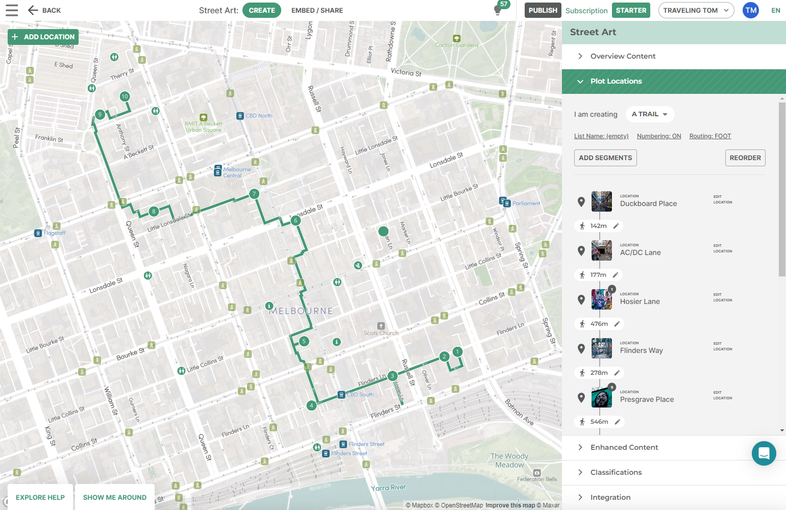
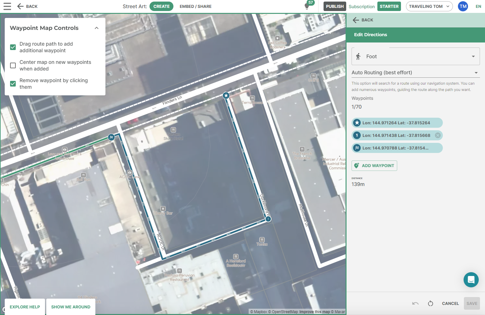

[//]: # "Layout: 1-col"
[//]: # "TOC: false"

# Example: City Laneway Tour

> Using the Alpaca services, it is quick and easy for your content team to plot
> walking trails, bike paths, and other routes on a map. This example shows how
> you can create a custom presentation of a city walking tour.

<iframe src="https://codesandbox.io/embed/simple-city-itinerary-xl7zgx?fontsize=14&hidenavigation=1&module=%2Fsrc%2FMap%2FItineraryMapLayer.tsx&theme=dark"
  style="width:100%; height:720px; border:0; border-radius: 4px; overflow:hidden;"
></iframe>

The above example shows loading an Alpaca itinerary on to a map. The itinerary
editor was used to make it easy to plot the routes, which require a tool for 
dropping specific points and choosing specific routes along the way. 

<aside class="note">
  Content teams can use the Alpaca Itinerary Editor in order to plot-out the 
  paths of content exactly how they want, with images, text and can link 
  to place information.
</aside>

<aside class="note">
  Routing can be controlled to be as specific as you want, with the ability to
  choose the exact path you want to take. It isn't about trying to go the 
  fastest way, it's about choosing exactly the path to take for the experience.
</aside>