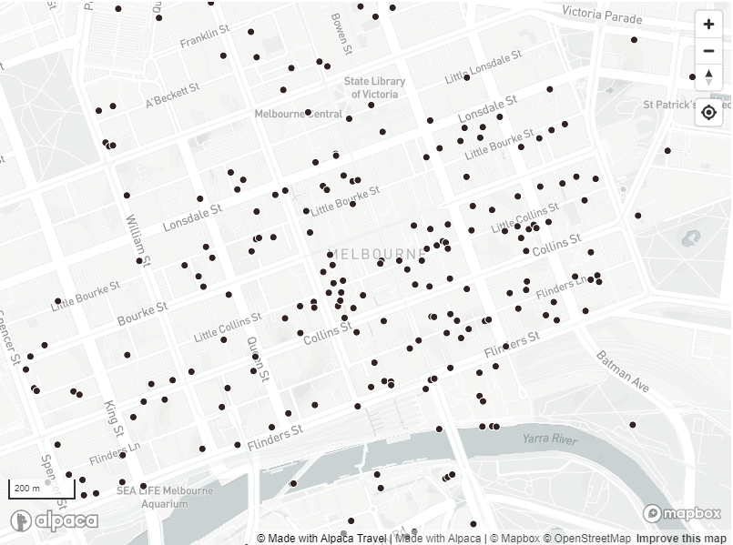

# Australian Tourism Data Warehouse (ATDW)

## Vector Tile Hosting

Alpaca Travel offers a vector tile hosting service that includes a regularly
updated database of ATDW products across Australia. This can be used by users
with ATDW Distributor agreements direct with ATDW in order to display a map
of all the ATDW products available in their region.



## Interactive Explorer

Alpaca offers an interactive explorer to review what data is visible within the
vector dataset.

[Interactive Explorer](https://mapping.withalpaca.travel/set/atdw)

## Feature Specification

Alpaca provides a feature specification that corresponds to commonly used
properties that can help you select and style your map accordingly.

_Example of Feature Properties_

```json
{
  "properties": {
    "id": "5b347afb3e8293ed17072934",
    "num": "AU0170827",
    "org_num": "OR0016918",
    "name": "Hotel Lindrum Melbourne - MGallery",
    "cat": "ACCOMM",
    "class": "[\"HOTEL\"]",
    "maki": "lodging",
    "atts": "[\"COVIDSAFE\",\"ACCOR\",\"24HOURS\",\"BAGROOM\",\"BAR\",\"BUSINESSFC\",\"CONVFAC\",\"NSMOKESTAB\",\"PAYTV\",\"STEREORADIO\",\"RESTAURANT\",\"TOURDESK\",\"FREEWIFI\",\"Luxury\",\"DISTASSIST\"]",
    "rate_from": 265,
    "rate_to": 595,
    "areas": "[\"Melbourne\"]",
    "regions": "[\"Melbourne\"]",
    "suburb": "Melbourne",
    "state_code": "VIC",
    "postcode": "3000",
    "has_deal": false
  }
}
```

Alpaca also determines a recommended 'maki' icon, which allows you to associate
an icon from the maki icon set. Alternatively, you may determine a way to style
a symbol in your application based on the `cat` or `class`.

## Adding to Mapbox

You can directly attach the ATDW products to your Mapbox map instance by adding
the following style source definition.

```json
"atdw": {
  "type": "vector",
  "data": "https://mapping.withalpaca.travel/v1/set/atdw.tilejson?scheme=xyz&accessToken=YOUR_ACCESS_TOKEN",
  "scheme": "xyz"
}
```

### Targeting Products

As an example, you can also add a style layer to your map, which will display
corresponding ATDW products.

_Displaying accommodation throughout Victoria_

```json
{
  "id": "vic_accomm",
  "type": "symbol",
  "source": "atdw",
  "source-layer": "default",
  "layout": {
    "icon-image": "{maki}",
    "text-field": ["get", "name"],
    "text-font": ["Open Sans Semibold", "Arial Unicode MS Bold"],
    "text-offset": [0, 1.25],
    "text-anchor": "top"
  },
  "filter": ["all", ["==", "state", "VIC"], ["==", "cat", "ACCOMM"]]
}
```

## Accessing Product Information

You can use the
[Alpaca Travel GraphQL API](https://www.github.com/AlpacaTravel/graphql-docs)
documentation which provides you an easy mechanism to access product information
from ATDW. This can enable you to present images, opening hours and more about
each of the products contained in the ATDW database.

```graphql
query {
  place(id: "place/atdw:product:5b347afb3e8293ed17072934") {
    # Access information about the business
    name
    address {
      addressLineOne
      addressLineTwo
      addressLineThree
      locality
      region
      regionCode
      country
      countryCode
    }
    contact {
      phoneNumber
      emailAddress
      websiteUrl
      bookingUrl
      facebookUrl
      instagramUrl
      twitterUrl
    }

    # Draw out a thumbnail
    preferredMedia {
      resource {
        ... on MediaImage {
          thumbnail: source(bestFit: [200, 200])
          altText
          attribution
        }
      }
    }

    # Select more about the product, see the documentation how to access any
    # attribute or other information from ATDW
  }
}
```

If you are building a simple interactive map you can also review using the
fetch SDK we offer which can be included with a unpkg script tag and can make
calls to the API.

```html
<!DOCTYPE html>
<html>
  <head>
    <!-- Include the script in your head -->
    <script src="https://unpkg.com/@alpaca-travel/graph-sdk-fetch@latest/dist/umd/graph-sdk.min.js"></script>
  </head>

  <body>
    <script type="text/javascript">
      // Update below
      const ACCESS_TOKEN = "UPDATE_WITH_YOUR_ACCESS_TOKEN";

      // Create the SDK
      const sdk = alpacaGraphSdk.getClientSdk({
        url: `https://withalpaca.com/api/graphql?accessToken=${ACCESS_TOKEN}`,
      });

      // Perform a SDK function
      // See the rest of the API Documentation
      // https://alpacatravel.github.io/graph-sdk/packages/fetch/docs/
      sdk
        .getPlace({
          id: "place/atdw:product:5b347afb3e8293ed17072934",
        })
        .then(({ data }) => console.log(data))
        .catch(console.error);
    </script>
  </body>
</html>
```

See More:

- [Alpaca Travel SDK](https://github.com/AlpacaTravel/graph-sdk)
