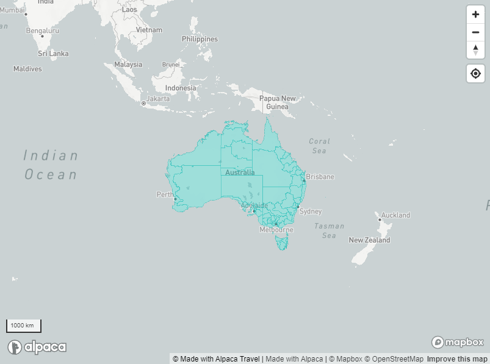

# Australian Tourism Regions

## Vector Tile Hosting

Alpaca Travel offers a vector tile hosting service which provides access to the
current Australian Tourism Regions for presenting on interactive maps. This can
help build interactive maps that can display to the user various regions and
sub-regions across Australia.



## Interactive Explorer

Alpaca offers an interactive explorer to review what data is visible within the
vector dataset.

[Interactive Explorer](https://mapping.withalpaca.travel/set/abs_2021_tourism)

## Feature Specification

Alpaca provides a specification derived from the ABS data set, allowing you
to target and create interactions with data.

_Example of Feature Properties_

```json
{
  "properties": {
    "class": "place_polygon",
    "TR_CODE21": "2R040",
    "TR_NAME21": "Great Ocean Road",
    "STE_NAME21": "Victoria",
    "STE_CODE21": "2",
    "id": "place/abs:2021-tourism:2r040",
    "label": "Great Ocean Road"
  }
}
```

## Adding to Mapbox

You can directly attach the ATDW products to your Mapbox map instance by adding
the following style source definition.

```json
"tourism": {
  "type": "vector",
  "data": "https://mapping.withalpaca.travel/v1/set/abs_2021_tourism.tilejson?scheme=xyz&accessToken=YOUR_ACCESS_TOKEN",
  "scheme": "xyz"
}
```

### Targeting Products

As an example, you can also add a style layer to your map, which will display
corresponding ATDW products.

_Displaying Regions of New South Wales_

```json
{
  "id": "maine",
  "type": "fill",
  "source": "tourism",
  "source-layer": "default",
  "layout": {},
  "paint": {
    "fill-color": "#0080ff",
    "fill-opacity": 0.5
  },
  "filter": ["==", "STE_NAME21", "New South Wales"]]
}
```
