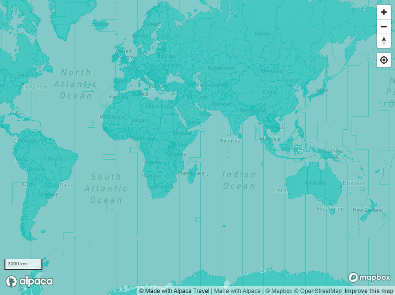

[//]: # "Weight: 4"
[//]: # "Layout: 1-col"
[//]: # "toc: false"

# Natural Earth

## Vector Tile Hosting

Alpaca Travel offers vector tile hosting for the cultural data of natural earth
to create additional interactivity with mapping based on cultural data.



Natural Earth provides a number of cultral datasets that can be used for various
mapping needs. These are broken out to specific vector layers

This includes the following map data:

- Countries (Vector layer: "countries")
- State and Provinces (Vector layer: "statesprovinces")
- Timezones (Vector layer: "timezone")

## Interactive Explorer

Alpaca offers an interactive explorer to review what data is visible within the
vector dataset.

[Interactive Explorer](https://mapping.withalpaca.travel/set/naturalearth_cultural)

## Feature Specification

_Example of Country Properies_

```json
{
  "properties": {
    "class": "place_polygon",
    "ISO_A2": "AU",
    "ISO_A3": "AUS",
    "CONTINENT": "Oceania",
    "SUBREGION": "Australia and New Zealand",
    "REGION_WB": "East Asia & Pacific",
    "REGION_UN": "Oceania",
    "NAME": "Australia",
    "FORMAL_EN": "Commonwealth of Australia",
    "featurecla": "Admin-0 country",
    "id": "place/naturalearth:iso-3166-1:au",
    "label": "Australia"
  }
}
```

_Example of States/Provinces Properies_

```json
{
  "properties": {
    "class": "place_polygon",
    "iso_3166_2": "AU-VIC",
    "abbrev": "Vic.",
    "name": "Victoria",
    "featurecla": "Admin-1 scale rank",
    "id": "place/naturalearth:iso-3166-2:au-vic",
    "label": "Victoria"
  }
}
```

_Example of Timezone Properies_

```json
{
  "properties": {
    "class": "place_polygon",
    "time_zone": "UTC+03:00",
    "featurecla": "Timezone",
    "id": "place/naturalearth:time-zone:utc0300",
    "label": "UTC+03:00"
  }
}
```

## Adding to Mapbox

You can directly attach the ATDW products to your Mapbox map instance by adding
the following style source definition.

```json
"tourism": {
  "type": "vector",
  "data": "https://mapping.withalpaca.travel/v1/set/natural_earth.tilejson?scheme=xyz&accessToken=YOUR_ACCESS_TOKEN",
  "scheme": "xyz"
}
```
