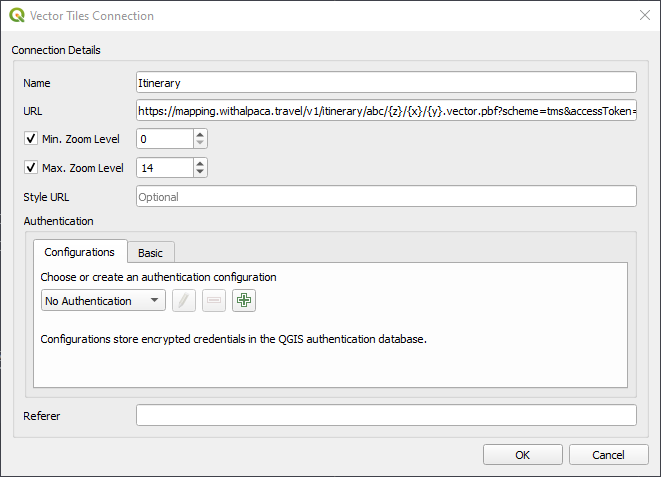

# Viewing Your Itinerary in QGIS

QGIS is a free and open-source geographic information system (GIS) software that
allows users to visualize, edit, and analyze geospatial data. If you have
created an itinerary on the Alpaca Travel platform, you can easily view your
itinerary data in QGIS by adding a Vector Tile Connection.

Reference:

- [Working with GeoJSON and Vector Tiles](/topics/itinerary/Working%20with%20GeoJSON%20and%20Vector%20Tiles/README.md)
  An overview to getting started with GeoJSON and Vector Tiles when working with
  itineraries.
- [Alpaca Travel GeoJSON and Vector Tiles Reference](/reference/itinerary/GeoJSON%20and%20Vector%20Tiles/README.md)

## Adding a Vector Tile Connection

To add a Vector Tile Connection in QGIS, follow these steps:

1. Open QGIS and go to the Browser panel on the left side of the screen.

2. Right-click on the Vector Tiles folder and select New Connection.

3. In the Vector Tiles Connection dialogue box, enter a name for your connection
   (e.g., Alpaca Travel Itinerary).
   In the URL field, enter the x,y,z URL provided by Alpaca Travel: `https://mapping.withalpaca.travel/v1/itinerary/abc/{z}/{x}/{y}.vector.pbf?scheme=tms&accessToken=YOUR_ACCESS_TOKEN`
   Replace "itinerary/abc" in the URL with your own itinerary ID, and replace "YOUR_ACCESS_TOKEN" with your access token.

4. Click OK to save your new connection.

Your Alpaca Travel itinerary will now be available under the Vector Tiles folder
in the Browser panel. Simply drag and drop it into the QGIS canvas to view your
itinerary data on the map.

